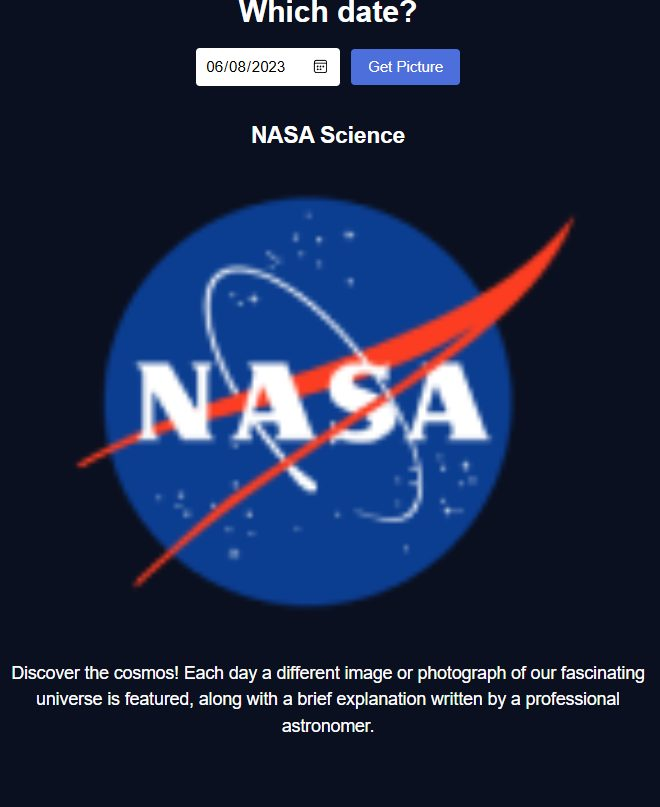

# NASA Picture of the Day

Pick a date, get NASA's Astronomy Picture of the Day for it.

The catch: the API doesn't always send a picture. Some days it's a video. The code has to check what it got and show the right element while hiding the other, or you end up with a broken image where a video should be.

NASA's APOD API, vanilla JavaScript fetch. My code is on the `answer` branch.
